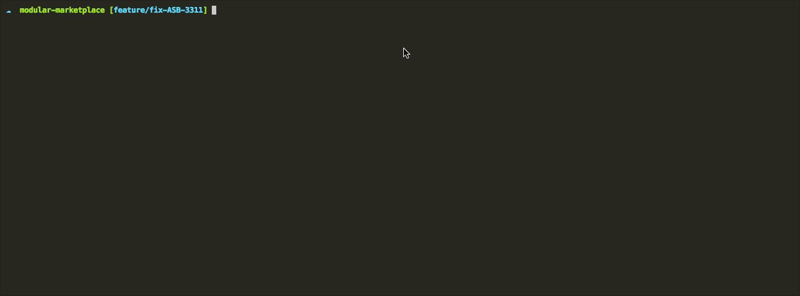
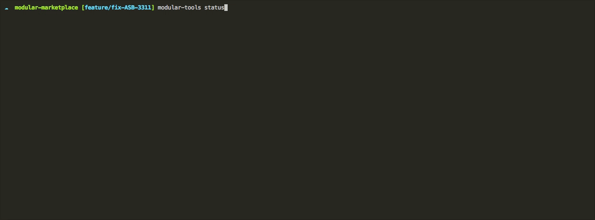

# Modular Tools

### How to use
```
git clone https://github.com/Weerapat1993/modular-tools.git
cd modular-tools
npm install -g
```

### Modular Config Project
```sh
modular-tools config
```

### Add Modular Config


### Remove Modular Config


### Commit `Child Modular` to `Parent Modular`
```sh
modular-tools commit
```

### Clone Modular

