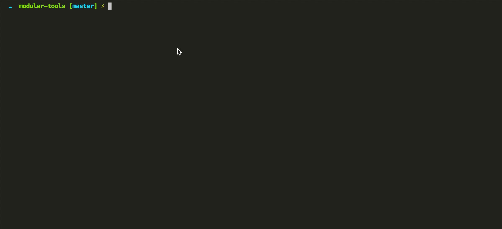
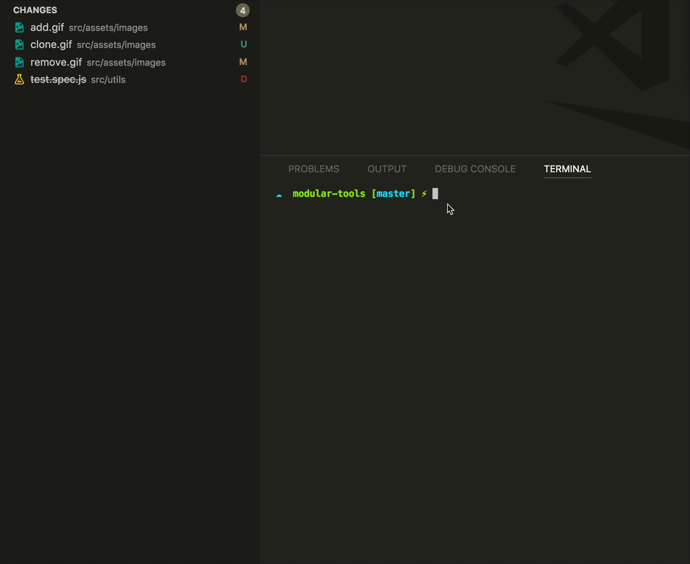

# Modular Tools

## Modular Standard Style Guide (Incomplete)

## Table of Contents
* [Folder Structure](./docs/folder-structure.md)
  * [Common](./docs/folder-structure.md#common)
  * [Features](./docs/folder-structure.md#features)
  * [Scenes](./docs/folder-structure.md#scenes)
  * [Utils](./docs/folder-structure.md#utils)
* [Constants](./docs/constants.md)
  * [Endpoints](./docs/constants.md#1-endpoints)
  * [Action Types](./docs/constants.md#2-action-types)
* [Component](./docs/component.md)
  * [PropTypes](./docs/component.md#1-proptypes)
  * [Constructor](./docs/component.md#2-constructor)
  * [Bind This](./docs/component.md#3-bind-this)
* [Container](./docs/container.md)
  * [mapStateToProps](./docs/container.md#1-mapstatetoprops)
  * [mapDispatchToProps](./docs/container.md#2-mapdispatchtoprops)
  * [Use Connector](./docs/container.md#3-use-connector)
* [Actions](./docs/actions.md)
* [Reducer](./docs/reducer.md)
  * [State in Reducer](./docs/reducer.md#1-state-in-reducer)
  * [Function Reducer](./docs/reducer.md#2-function-reducer)
  * [Class Reducer](./docs/reducer.md#3-class-reducer)
* [JSDoc - เขียน Comment อย่างไรให้อ่านแล้วเข้าใจง่าย](./docs/jsdoc.md)
* [Base Style - การเขียน StyleSheet ในรูปแบบ Class](./docs/base-style.md)
* [User Interface State ทุกแอปพลิเคชั่นควรมี](./docs/error-handling.md)


### How to use
```
git clone https://github.com/Weerapat1993/modular-tools.git
cd modular-tools
npm install -g
```

### Create File in Project
```sh
modular make:common [name] # Mobile only
modular make:component [name] # Web only
modular make:feature [name]
modular make:scene [name] # Mobile only
modular make:page [name] # Web only
modular make:util [name]
```

### Create New Project
```sh
modular init [name]
```

### Modular Config Project
```sh
modular config
```

### Add Modular Config


### Remove Modular Config


### Commit Modular
- Copy File git diff in `/src` to `Parent Modular`

```sh
modular commit
```



### Clone Modular
- Copy Folder `/src` to `Parent Modular`

```sh
modular clone
```


