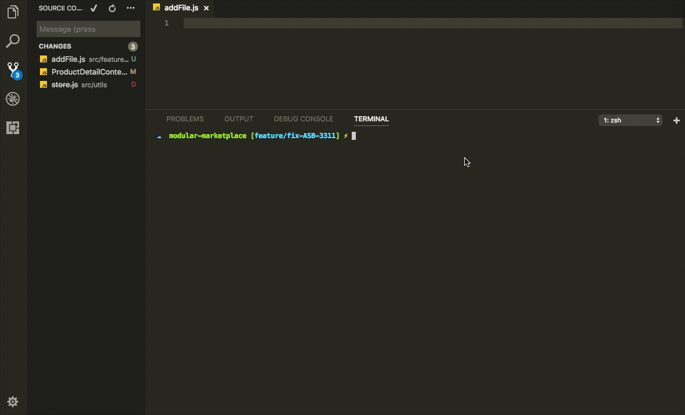

# Modular Tools

### How to use
```
git clone https://github.com/Weerapat1993/modular-tools.git
cd modular-tools
npm install -g
```

### Create New Modular Project
```sh
modular init <project_name>
```

### Modular Config Project
```sh
modular config
```

### Add Modular Config


### Remove Modular Config


### Commit Modular
- Copy File git diff in `/src` to `Parent Modular`

```sh
modular commit
```



### Clone Modular
- Copy Folder `/src` to `Parent Modular`

```sh
modular clone
```


