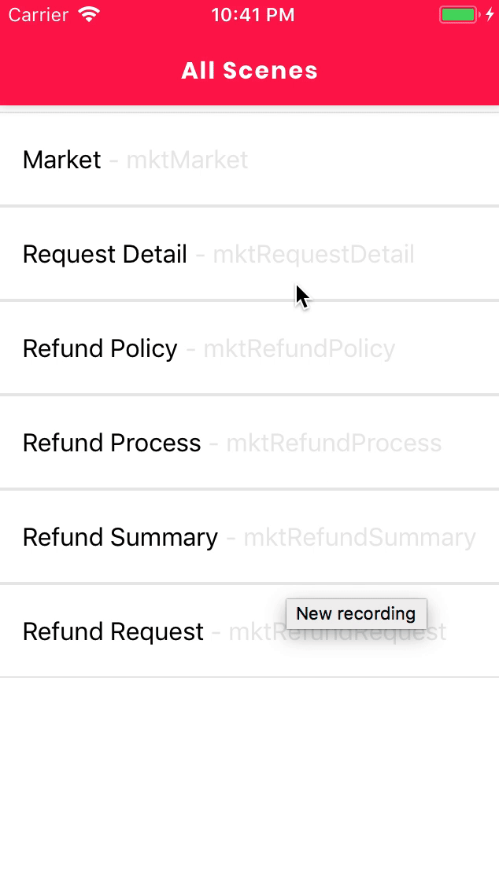

# User Interface State ทุกแอปพลิเคชั่นควรมี

[< Back](../README.md)

## User Interface State
* [Ideal State](#ideal-state)
* [Empty State](#empty-state)
* [Over State](#over-state)
* [Partial State](#partial-state)
* [Loading State](#loading-state)
* [Error State](#2-mapdispatchtoprops)

### Ideal State
- หน้าแสดงสถานะข้อมูลสมบูรณ์ครบถ้วนพร้อมแสดงผล

### Empty State
- หน้าแสดงข้อมูลให้ผู้ใช้งานรับทราบว่ายังไม่มีข้อมูลแสดง

### Over State
- หน้าแสดงข้อมูลจำนวนมากกว่าปกติ

### Partial State
- หน้าแสดงข้อมูลที่บอกว่ายังไม่สมบูรณ์

### Loading State
- สถานะกำลังโหลดข้อมูล

### Error State
- สถานะกำลังโหลดข้อมูล

### ตัวอย่างการทำ Error Handling

**Reference**
* [https://medium.com/20scoops-cnx/user-interface-state-ทุกแอปพลิเคชั่นควรมี-69afe4b5b09](https://medium.com/20scoops-cnx/user-interface-state-ทุกแอปพลิเคชั่นควรมี-69afe4b5b09)

[Back to Top](#user-interface-state)